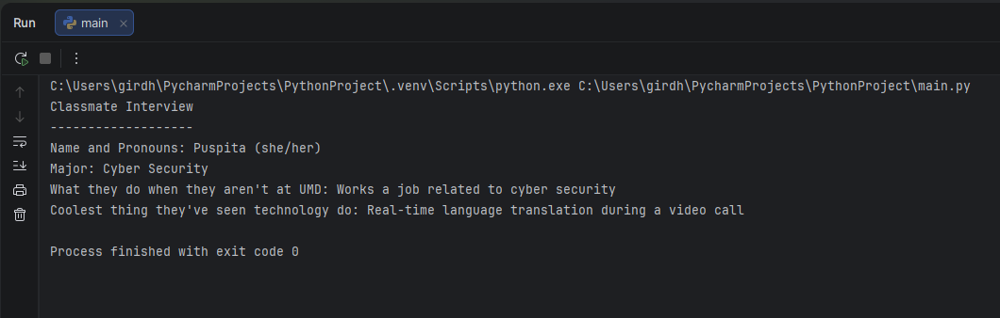

# Classmate Interview Program

This project is a simple Python program that displays answers from a classmate interview.  
The program prints information about the classmate, including their major and interests.

## Interview Information
- **Name and Pronouns:** Puspita (she/her)
- **Major:** Cyber Security
- **What they do when they aren't at UMD:** Works a job related to cyber security
- **Coolest thing they've seen technology do:** Real-time language translation during a video call

## How to Run the Program
1. Make sure Python is installed on your computer
2. Open the project in PyCharm
3. Run the file `main.py`

## Program Output
Below is a screenshot of the program output after running the code:

